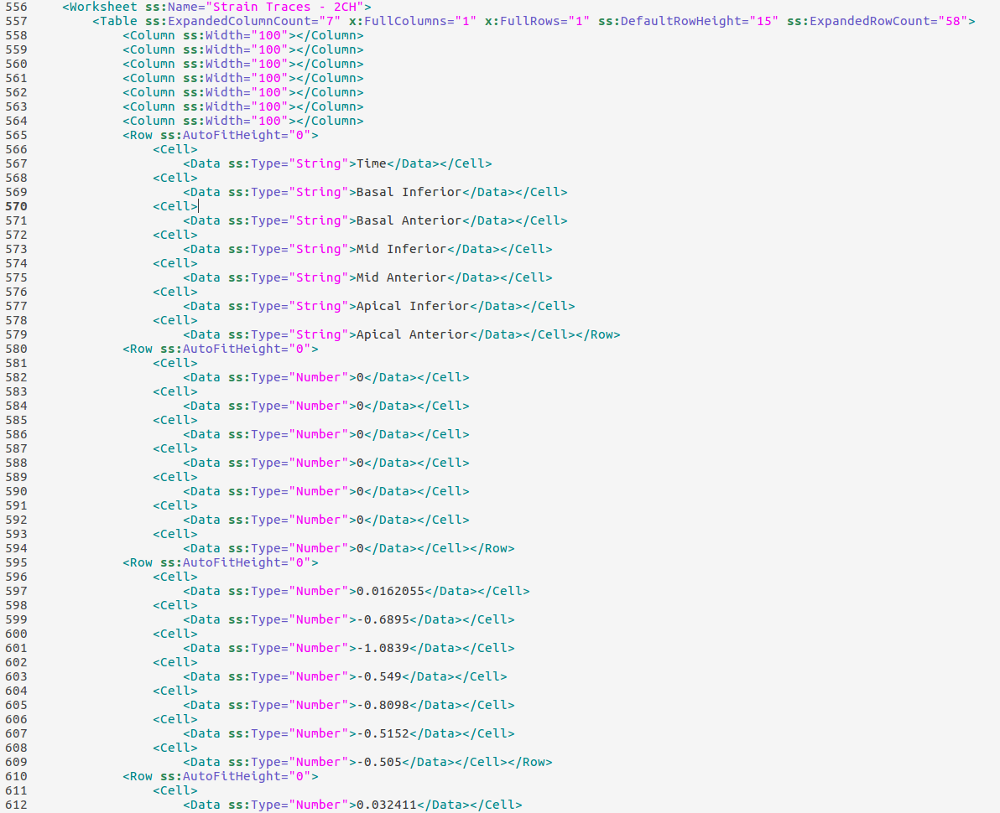
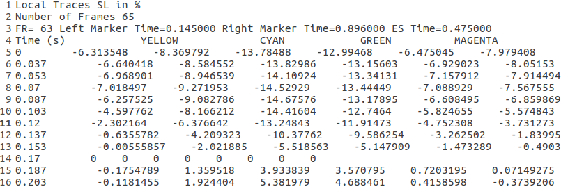

# Building inductive data set from individual patient data for analysis and visualization
The project consists of methods to build a data set from patient-specific samples, providing the user with a tidy,
organized table to explore and hypothesize. In explicit, from a given set of .xml files exported from the 
**EchoPAC** software, a single table is generated, consisting of all relevant fields accounted for during clinical image 
analysis. With cases as rows and features as columns, the data set is designed for quick exploration and statistical
research.

### Extracted features
From the **EchoPAC** exports, the following parameters are extracted:
 * Heart rate,
 * Valve opening times,
 * Blood pressure,
 * Ejection fraction
 * Global and segmental work indices:
    * Myocardial work efficiency,
    * Constructive work,
    * Wasted work,
    * Positive work,
    * Negative work,
    * Systolic constructive work,
    * Sysystolic wasted work,
 * Post-systolic strain,
 * Average segmental strain,
 * Systolic and diastolic pressure,
 * Global and segmental strain measurements.
   
In addition to the raw indices, new features were derived, to provide the user with information relevant for 
results publication, such as:
 * Frame rate for each of the views (4C, 3C, 2C),
 * Segmental post-systolic boolean classification, which indicates whether the minimum strain took place after the 
 aortic valve closure (AVC),
 * Segmental post-systolic index - ratio between the strain at AVC and the minimum strain,
 * Segmental minimum strain value,
 * Segmental strain value at AVC,
 * Segmental time-to-peak - time from th beginning of the cycle to minimum strain,
 * Segmental time-to-peak ratio - ratio between time-to-peak and cycle duration,
 * Minimum global strain before AVC,
 * Minimum global strain,
 * Time of minimum global strain.
 
### Complementary tools

A few additional functions are implemented to ease the visualization and comparative studies. In explicit, the values 
necessary for createing 17 and 18 AHA polar plots of the left ventricle are provided. The functions build a data frame
consisting of mean and median values of the parameters of interest, one for each of the 17 or 18 segments. These values
can be obtained for multiple categorized patient groups. Moreover, the representatives of each group (closest to the
mean or median with regards to segmental values) are found.

# Motivation
Statistical models rely on the sets of samples to infer the behaviour of similar samples, classifiy them and build
predictions based on them. In general, the more samples are gathered, the more robust and reliable the model is and more
features of a sample can be explored. Population studies on the relatively new indices of function such as strain
and myocardial work are becoming increasingly popular, however it is difficult to gather the data necessary for analysis
and inductive reasoning.

EchoPAC software enables an export of individual patient data on the structure and function of the left ventricle. The
data is saved in the .xml or .txt files, which are not designed for research. Obtaining comparable data is hindered by
the structure of these exports, making it difficult to perform comparative studies for clinicians. With this tool, the 
data is transformed into easily applicable structure at a minimal cost.

# Screenshots 
All presented screenshot come form randomly created, probable data representing the original exports from the 
**EchoPAC** software.

### Input - export file in .xml fromat with functional data of a single patient
The data is provided in a specific XML structure, which is illegible. It is also possible to open the file with
applications such us MS Excel, as a table. However, population studies on these files would be time-consuming and 
laborious.



### Input - export file in .txt format with functional data of a single patient
Less data is available in the case of a single view export. However, it is still possible to extract the data on
segmental strain (color-coded).



---
---

### Output - myocardial function population data
ID | HR (1/min) | MVC (ms) | ... | GWE (%) | GWI (mmHg%) |... |  SBP (mmHg) | DBP (mmHg) | MW_Basal Inferior (mmHg%) | MW_Basal Posterior (mmHg%)| ...
 :---:|:---:|:---:| :---: | :---: | :---: | :---: | :---: | :---: | :---: | :---: | :---:  
ABC001 | 63	| 24    | ... | 0.97	| 2054  | ... | 136	| 83	| 1524	| 2234	| ... 
ACD002 | 77	| 45	| ... | 0.99	| 1725	| ... | 121	| 73	| 1281	| 1875 | ... 
ADE003 | 79	| 38	| ... | 0.97	| 2262	| ... | 152	| 92	| 1362	| 2893 | ... 
AEF004	| 65 | 32	| ... | 0.95	| 1254	| ... | 115	| 77	| 1123	| 1490 | ... 
AFG005	| 67 | 13	| ... | 0.96	| 2032	| ... | 134	| 85	| 1552	| 1750 | ... 
AGH006	| 84 | 37	| ... | 0.98	| 2472	| ... | 126	| 72	| 2762	| 3312 | ... 
... |... |... |... |... |... |... |... |... |... |... |... 

### Output - mean and median values of strain and myocardial work in the population
statistic_parameter_ group label|	Basal Inferior	| Basal Posterior	| Basal Lateral	| Basal Anterior	| Basal Anteroseptal	| Basal Septal	| Mid Inferior	| ...
:---:|:---:|:---:| :---: | :---: | :---: | :---: | :---: | :---: 
mean_MW_2	|1878	|2243	|2211	|1855	|1960	|1739	|2088	| ...
median_MW_2	|1931	|2234	|2179	|1855	|1931	|1693	|2088	| ...
mean_MW_1	|1753	|2065	|2157	|1834	|1710	|1770	|1997	| ...
median_MW_1	|1734	|2056	|2275	|1843	|1705	|1770	|1997	| ...
mean_strain_avc_2	|-17	|-18	|-19	|-17	|-17	|-15	|-20	| ...
median_strain_avc_2	|-17	|-17	|-19	|-17	|-18	|-14	|-20	| ...
mean_strain_avc_1	|-18	|-16	|-19	|-18	|-18	|-17	|-22	| ...
median_strain_avc_1	|-19	|-16	|-18	|-17	|-18	|-17	|-21	| ...


### Output - printed representatives of the given patient groups

Label | MW | strain_avc | strain_min | all
:---:|:---:|:---:| :---: | :---: 
0 | AAA0|AAA1|	AAA2|	AAA1
1|	BBB0|	BBB1|	BBB2|	BBB3
2|	CCC0|	CCC1|	CCC2|	CCC0

# How2use

### class EchoDataSet

**Call**
```python
from echo_data_set import EchoDataSet
path_to_data = 'data/exports'
path_to_output = 'data/output'
eds = EchoDataSet(input_path=path_to_data, output_path=path_to_output, output='all_cases.csv', 
                  export_file_type='xml', timings_file='timings.xlsx')
   
```

**Input**

*input_path*: path to the folder with .xml/.txt files containing the exports from **EchoPAC**;

 
*output_path*: path to a folder where the resulting table, the 17 and/or 18 AHA values and group representatives
will be stored;

*output*: name of the file to which the table is saved;

*export_file_type*: xml or txt, the type of exports from which the data set is created;

*timings_file*: used only in the case of txt exports. The file should contain the timings of AVC in milliseconds for
each available patient.
 
**Output** 

An .xlsx or .csv file with the data set of all patients available in the input folder.

---
### Methods

```python
build_data_set_from_xml_files()
```
Creates the popluation data from the *EchoPAC* exports in xml format (with myocardial work indices).

```python
build_data_set_from_txt_files()
```
Creates the popluation data from the *EchoPAC* exports in txt format (from single view).

```python
get_aha_values(label_col='Classification', n_segments=18, labels_file='List of patients with labels.xlsx',
                         representatives=True)
```
Obtain the mean and median segmental values of parameters of interest, with respect to the patient classes (groups). 
 
Parameters:
* *features*: parameters to extract 
* *label_col*: name of the column with classification of the patients
* *representatives*: whether to produce the table of class (group) representative patients
* *n_segments*: 17 or 18 - as used for creating the AHA plots
* *labels_file*: name of the file containing patient classification

Output:
Either the list of group representatives 
or means and medians segmental values of the parameters of interest

# Credits
Loncaric F, Nunno L, Mimbrero M, Marciniak M, Fernandes JF, Tirapu L, Fabijanovic D, Sanchis L, Doltra A, Cikes M, Lamata P, Bijnens B, Sitges M. 
*Basal Ventricular Septal Hypertrophy in Systemic Hypertension.* 
Am J Cardiol. 2020 May 1;125(9):1339-1346. doi: 10.1016/j.amjcard.2020.01.045. Epub 2020 Feb 8. PMID: 32164912.

# License
The code is openly available. If this tool has been useful in your research, please reference this site 
https://github.com/MaciejPMarciniak/EchopacExportsReader
